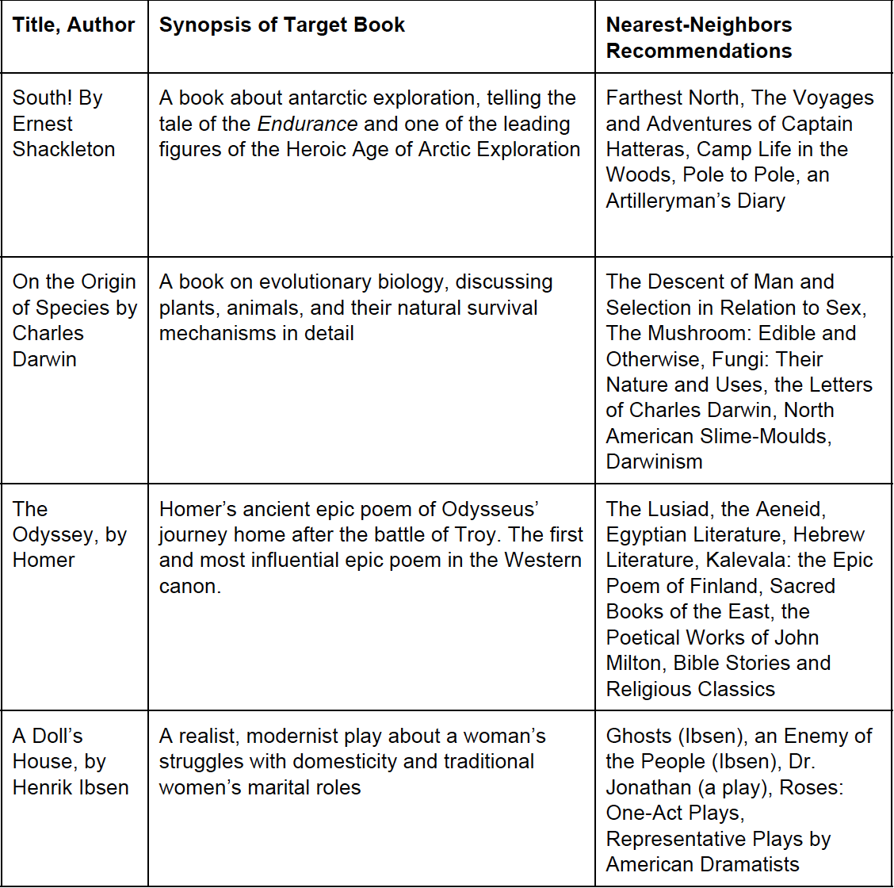

# Gutenberg
A Content Based Recommender using Project Gutenberg's entire database of books.

This system models literary style and taste using
* Punctuation profiles
* Part-of-speech tagging
* TF-IDF clustering
* Sentiment analysis
* Other linguistic features

-----------

### Sample Recommendations




--- 

### How to Use It

1. Download the data
2. Run knn.py. The command prompt will ask you for the name of a book you enjoy.
3. You're done! Let us know if the recommendations fit your taste. 

--- 

## Steps for Replication

### Data Collection
1. Run the shell script getBooks.sh to start pulling books from Project Gutenberg. Unzip the texts, then run strip_headers.py to get rid of the legal info in the headers and footers of all Project Gutenberg texts. This will take a while to run, and the entire text corpus may not be necessary (will be roughly 20gb in total). As an alternative, see the University of Michigan text corpus af 3000 books [here](http://web.eecs.umich.edu/~lahiri/gutenberg_dataset.html)

### Feature Extraction
1. Run in terminal: preprocessing.py. This creates an output file with '|' delimeted features. Runs sentiment analysis, takes punctuation and part-of-speech profiles, gets other basic features.

### Run TFIDF clustering
1. If set is small enough to run locally, run in terminal: 

```
/[usr dir]/spark-submit /[usr dir]/TFIDF_Kmeans.py "/[usr dir]/[data set input]/" "/[usr dir]/[output dir]"
```
If using a larger text corpus, we recommend uploading the books to Amazon EC2 and running this script on Elastic MapReduce.

On AWS, this job outputs one file of cluster memberships for each slave node. The format is **(BOOKID.txt, clusterID)**.

### Form Recommendations
1. run knn.py
- enter book title and author name exactly as entered in the data (it will ask you to try again if not)
- see 15 nearest neighbors to the book in question

--------

### Next Steps / In Progress:
1. TFIDF-based search functionality (word_search.py)
2. Expanded feature extraction. (adding additional features to preprocessing.py)
3. Mongodb storage for sparse TFIDF data (populate_db.py)
4. A web app to make this easier to interact with 

-------
Team:  
James LeDoux 
Drew Hoo   
Aniket Saoji  

Blog post: [on James R LeDoux.com](http://jamesrledoux.com/projects/2016/11/01/gutenberg-recommender-system.html)
[backup on evernote](https://is.gd/rDGwSD)


